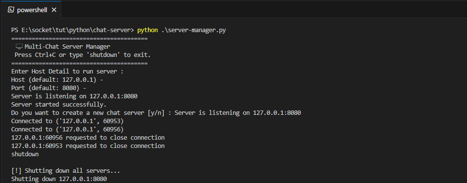
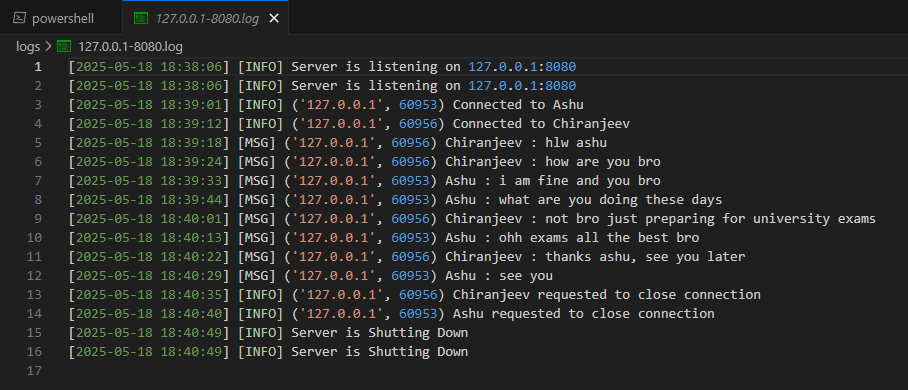
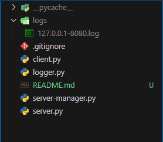

# 🧠 Multi-Server Chat System (Python Sockets)

[](https://www.python.org/)
[](https://opensource.org/licenses/MIT)
[]()
[]()
[]()

A lightweight terminal-based chat system that supports **multiple chat servers** and **multiple clients per server**, built using **Python Sockets**, **Threading**, and a server manager utility to control up to 5 servers at once.

---

## 🚀 Features

- 🧵 Multi-threaded chat servers
- 👥 Multiple clients per server
- 🖥️ Create & manage up to **5 independent chat servers**
- 📡 Real-time message broadcasting to all connected clients
- 🧠 Graceful shutdown using `Ctrl+C` or `shutdown` command
- 🔌 Robust error handling and recovery
- 🧰 Easy-to-use interactive CLI
- 📁 Logging chat history to file
- 🌐 Localhost support with custom IP/port binding

---

## 🧩 Components

### 📁 `server-manager.py`
- Launch up to 5 concurrent servers using a CLI tool.
- Handles port assignment and client connection.
- Gracefully shuts down all running servers on exit.

### 📁 `server.py`
- Defines the `SocketServer` class that manages client connections.
- Handles incoming messages, broadcasts them to all connected clients.

### 📁 `client.py`
- Connects to any server by IP and port.
- Sends and receives messages via terminal.
- Clean message formatting and thread-safe input/output.

---

## 📸 Screenshots

### ✅ Server Manager Starting New Servers


### ✅ Client Connection and Messaging


### ✅ Server Logs of Chatting and Events


### ✅ Folder Structure


---

## 🛠️ How to Run

### 1. Clone the Repository

```bash
git clone https://github.com/YashashavGoyal/chat-multi-server.git
cd chat-multi-server
```

---

### 2. Start the Server Manager

```bash
python server-manager.py
```

Follow the prompts to create up to 5 chat servers.

---

### 3. Connect Clients

```bash
python client.py
```

You can run multiple clients by opening new terminals and connecting them to the same server IP & port.

---

## 📌 Commands (Client Side)

- Type any message and hit `Enter` to send.
- Type `exit` or `q` to quit the chat gracefully.

---

## ⚠️ Limitations

- Servers are limited to 5 per session. (They are hard coded so you can increase)
- No encryption (yet) — all communication is plain-text.
- Designed for **LAN/local testing** only. (But can be scaled)

---

## 🧠 Planned Improvements

- 🔐 Add authentication and private rooms
- 🐳 Docker support for isolated server-client deployment
- 🌍 Host chat servers over public IP
- 🕵️‍♂️ Admin commands for muting/kicking users

---

## 🤝 Contributing

Feel free to fork the repo, suggest improvements, or open a pull request! Ideas and contributions are welcome.

---

## 📄 License

MIT License © 2025 Innu
